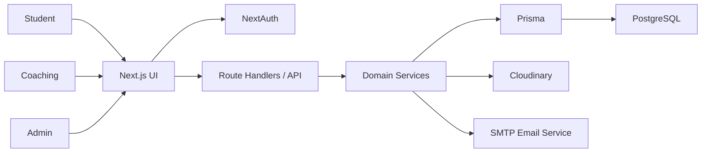

# CoachingHunt Architecture

## 1. Architecture Goal

Design a clean, maintainable full-stack application that can launch as a pilot quickly and still be extendable for future phases.

## 2. Recommended Stack

### Frontend

- `Next.js` App Router
- `React` with JavaScript only
- `Tailwind CSS`
- `Framer Motion`
- `React Hook Form`
- `Zod`

### Backend

- `Next.js Route Handlers`
- `Prisma ORM`
- `PostgreSQL`
- `NextAuth` with credentials auth
- `Nodemailer`
- `Cloudinary`

## 3. Architecture Style

Use a **modular monolith**.

Why:

- easiest to build in one repo
- easier than managing separate frontend/backend apps
- enough for pilot and early growth
- allows strong module boundaries without operational complexity

## 4. High-Level System Flow



## 5. Domain Modules

The app should be organized by domain, not by random utility sprawl.

### Core modules

- `auth`
- `users`
- `coachings`
- `courses`
- `demo-slots`
- `bookings`
- `reviews`
- `offers`
- `search`
- `dashboard`
- `admin`
- `notifications`

## 6. Proposed Folder Structure

```text
src/
  app/
    (public)/
    (auth)/
    (student)/
    (coaching)/
    (admin)/
    api/
  components/
    ui/
    shared/
    forms/
    marketing/
    dashboard/
  modules/
    auth/
    users/
    coachings/
    courses/
    demo-slots/
    bookings/
    reviews/
    offers/
    admin/
    search/
    notifications/
  lib/
    auth/
    db/
    email/
    cloudinary/
    constants/
    utils/
  styles/
    globals.css
    theme.css
  hooks/
  middleware.js
prisma/
public/
```

## 7. Route Groups

### Public

- homepage
- search
- coaching details
- course details
- about
- contact
- privacy policy

### Auth

- login
- student signup
- coaching signup

### Student

- dashboard
- bookings
- offers
- profile

### Coaching

- dashboard
- profile
- courses
- demo slots
- bookings

### Admin

- dashboard
- users
- coachings
- bookings
- reviews

## 8. Rendering Strategy

### Public pages

Use server rendering or static revalidation for:

- homepage
- search result pages
- coaching detail pages
- course detail pages

Reason:

- SEO
- faster first load
- better discoverability

### Authenticated dashboards

Use protected dynamic rendering for:

- student dashboard
- coaching panel
- admin dashboard

## 9. Authentication Design

Use `NextAuth` with Credentials provider.

### Why

- simple email/password flow
- fits current requirement
- easy to attach role and session metadata

### Session payload

- user id
- email
- role
- profile completion flags

## 10. Authorization Design

### Route protection

`middleware.js` should protect:

- `/student/*` for `STUDENT`
- `/coaching/*` for `COACHING`
- `/admin/*` for `ADMIN`

### API protection

Every protected API must:

- read session
- validate role
- validate record ownership

## 11. Public Visibility Strategy

Logged-out users can browse but should see partial details.

### Anonymous visibility

- coaching name
- city/locality
- tags
- rating summary
- preview description
- limited course summary

### Logged-in visibility

- full coaching profile
- course/batch details
- demo slot details
- booking action

This supports discovery while still encouraging signup.

## 12. UI Architecture

### Design system principles

- white-led interface
- premium blue accent
- central theme tokens
- reusable cards, buttons, inputs, tables, badges, tabs
- consistent spacing and rounded corners

### Theme management

Keep all major visual variables centralized.

Recommended:

- semantic CSS variables in `theme.css`
- Tailwind tokens mapped to variables

## 13. State Strategy

Keep state simple.

Use:

- server data fetching for page-level data
- form state with `React Hook Form`
- local component state for UI interactions

Avoid:

- unnecessary global client state
- over-complicated state libraries for MVP

## 14. Media Architecture

Use Cloudinary for:

- coaching logos
- cover images
- gallery images

Flow:

1. coaching requests signed upload support
2. frontend uploads directly to Cloudinary
3. URL stored in DB

## 15. Email Architecture

Use `Nodemailer` with SMTP.

Primary use case:

- demo booking confirmation email

Secondary future use cases:

- coaching lead notification
- admin alerts

## 16. Search Architecture

For MVP use PostgreSQL-backed search via Prisma with indexed fields.

Search targets:

- coaching name
- city
- locality
- exam tags
- subject tags
- course title

Do not add Elasticsearch or similar now.

## 17. Scalability Notes

This architecture is intentionally simple, but extensible.

Future upgrades can include:

- queue for email
- external search engine
- audit/event system
- payment microservice if required
- separate API service if scale demands it

## 18. Operational Principles

- keep code modular
- keep routes thin
- keep business logic in services
- use soft deletes/archive over hard deletes where possible
- log important actions

## 19. Key Architecture Decision Summary

### Decision 1

One repo, one app.

### Decision 2

Next.js handles both UI and backend.

### Decision 3

Prisma + Postgres for relational data.

### Decision 4

Role-separated dashboards and route groups.

### Decision 5

Modular monolith instead of microservices.
