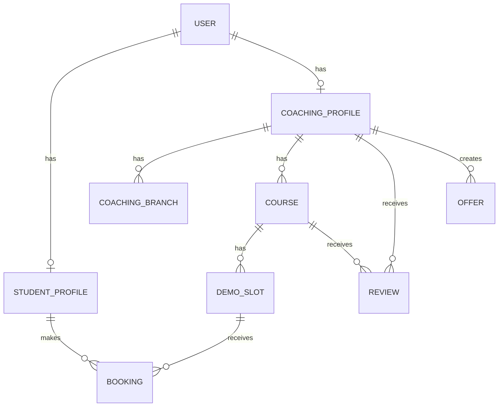

# CoachingHunt Database Design

## 1. Database Recommendation

Use `PostgreSQL` with `Prisma`.

Reason:

- strong fit for relational domain data
- easy schema evolution
- clean developer workflow
- sufficient for pilot launch

## 2. Core Entities

- User
- StudentProfile
- CoachingProfile
- CoachingBranch
- Course
- DemoSlot
- Booking
- Review
- Offer
- AuditLog

## 3. Entity Relationship Summary

## 4. User Model

### Purpose

Central auth identity and role record.

### Fields

- `id`
- `name`
- `email`
- `passwordHash`
- `phone`
- `role`
- `isActive`
- `emailVerifiedAt`
- `createdAt`
- `updatedAt`

### Constraints

- email unique

## 5. StudentProfile Model

### Purpose

Stores student-specific information.

### Fields

- `id`
- `userId`
- `city`
- `classLevel`
- `targetExam`
- `schoolName`
- `preferredSubjects`
- `createdAt`
- `updatedAt`

### Constraints

- `userId` unique

## 6. CoachingProfile Model

### Purpose

Stores coaching-level public listing and business profile data.

### Fields

- `id`
- `userId`
- `name`
- `slug`
- `tagline`
- `description`
- `foundedYear`
- `phone`
- `alternatePhone`
- `email`
- `website`
- `mode`
- `category`
- `targetExams`
- `subjects`
- `facilities`
- `logoUrl`
- `coverImageUrl`
- `galleryImages`
- `city`
- `locality`
- `addressLine1`
- `addressLine2`
- `pincode`
- `latitude`
- `longitude`
- `verificationStatus`
- `listingStatus`
- `avgRating`
- `reviewCount`
- `createdAt`
- `updatedAt`

### Constraints

- `slug` unique
- `userId` unique

## 7. CoachingBranch Model

### Purpose

Supports single-branch and multi-branch coachings without redesign later.

### Fields

- `id`
- `coachingId`
- `branchName`
- `city`
- `locality`
- `address`
- `phone`
- `isPrimary`
- `createdAt`
- `updatedAt`

## 8. Course Model

### Purpose

Represents a coaching offering, either a course or batch.

### Fields

- `id`
- `coachingId`
- `branchId`
- `title`
- `slug`
- `description`
- `courseType`
- `targetExam`
- `classLevel`
- `subjectStream`
- `facultySummary`
- `language`
- `batchSize`
- `deliveryMode`
- `fees`
- `discountedFees`
- `durationText`
- `startDate`
- `endDate`
- `scheduleSummary`
- `status`
- `isFeatured`
- `createdAt`
- `updatedAt`

### Constraints

- `slug` unique

## 9. DemoSlot Model

### Purpose

Represents a bookable demo session under a course or batch.

### Fields

- `id`
- `courseId`
- `coachingId`
- `branchId`
- `topic`
- `teacherName`
- `teacherProfile`
- `demoDate`
- `startTime`
- `endTime`
- `durationMinutes`
- `capacity`
- `bookedCount`
- `venueName`
- `venueAddress`
- `instructions`
- `status`
- `createdAt`
- `updatedAt`

## 10. Booking Model

### Purpose

Tracks a student booking for a demo slot.

### Fields

- `id`
- `studentId`
- `demoSlotId`
- `courseId`
- `coachingId`
- `bookingCode`
- `status`
- `emailStatus`
- `notes`
- `createdAt`
- `updatedAt`

### Constraints

- unique composite on `studentId + demoSlotId`
- `bookingCode` unique

## 11. Review Model

### Purpose

Stores student reviews for coachings or optionally courses.

### Fields

- `id`
- `studentId`
- `coachingId`
- `courseId`
- `rating`
- `title`
- `comment`
- `status`
- `createdAt`
- `updatedAt`

## 12. Offer Model

### Purpose

Stores promotional offers shown to students.

### Fields

- `id`
- `coachingId`
- `title`
- `description`
- `validFrom`
- `validTill`
- `status`
- `createdAt`
- `updatedAt`

## 13. AuditLog Model

### Purpose

Tracks important admin or coaching actions.

### Fields

- `id`
- `actorUserId`
- `actorRole`
- `action`
- `entityType`
- `entityId`
- `metaJson`
- `createdAt`

## 14. Recommended Enums

### UserRole

- `ADMIN`
- `COACHING`
- `STUDENT`

### CoachingMode

- `OFFLINE`
- `ONLINE`
- `HYBRID`

### VerificationStatus

- `PENDING`
- `VERIFIED`
- `REJECTED`

### ListingStatus

- `DRAFT`
- `ACTIVE`
- `PAUSED`
- `ARCHIVED`

### CourseType

- `COURSE`
- `BATCH`

### DeliveryMode

- `OFFLINE`
- `ONLINE`
- `HYBRID`

### DemoSlotStatus

- `OPEN`
- `FULL`
- `CANCELLED`
- `COMPLETED`

### BookingStatus

- `CONFIRMED`
- `CANCELLED`
- `ATTENDED`
- `NO_SHOW`

### EmailStatus

- `PENDING`
- `SENT`
- `FAILED`

### ReviewStatus

- `PENDING`
- `APPROVED`
- `REJECTED`

## 15. Important Relationships

- one `User` has one `StudentProfile` or one `CoachingProfile`
- one `CoachingProfile` has many `Courses`
- one `Course` has many `DemoSlots`
- one `StudentProfile` has many `Bookings`
- one `DemoSlot` has many `Bookings`
- one `CoachingProfile` has many `Reviews`

## 16. Important Database Rules

- no duplicate booking for same student and demo slot
- booked count must never exceed capacity
- every demo slot belongs to a course
- every course belongs to a coaching
- only approved reviews count toward rating
- prefer archive/soft delete over hard delete

## 17. Indexing Recommendations

Add indexes on:

- `User.email`
- `CoachingProfile.slug`
- `CoachingProfile.city`
- `CoachingProfile.locality`
- `Course.slug`
- `Course.coachingId`
- `Course.targetExam`
- `DemoSlot.courseId`
- `DemoSlot.demoDate`
- `Booking.studentId`
- `Booking.coachingId`

## 18. Seed Data Recommendation

Seed the database with:

- 1 admin
- 3 sample coachings
- 2 branches
- 8 sample courses/batches
- 15 sample demo slots
- 5 students
- sample bookings
- sample offers

## 19. Future Database Extensions

- favorites/wishlist table
- compare snapshots
- notification table
- payment table
- enrollment table
- page view analytics table
